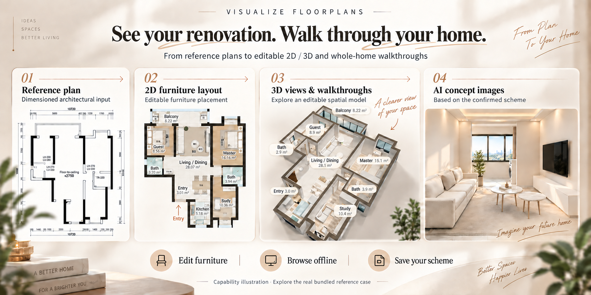
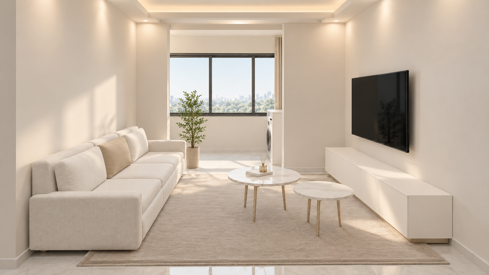

# Floor Visualization

English | [中文](./README.zh.md)

For homeowners and renovation design teams: review a floor plan and furniture
references, edit one H5 renovation
scheme, then create interior concepts and a camera preflight from that same
version. Structure, layout and finish decisions remain traceable across outputs.

## Preview



AI-generated capability illustration based on the bundled case references. Explore the real workbench, drawings and tour in the complete reference case below; AI concept images and the editable 3D scene are distinct outputs.

**Local Beta version: 0.2.0-beta.4.** Adds reusable interaction regression,
room-area pending detection after wall edits, main-light coverage warnings,
case-configurable marble and modular runtime logic. Rectangle, concave and
furnished lighting stress fixtures are exercised separately from client visual
acceptance. Windows, physical mobile devices and generative final video remain
unverified. Earlier validation runs were local; this release includes the curated reference case. See [current checks](references/beta4-workbench-validation.md).

Read [quality gates](references/h5-quality-gates.md) before source interpretation,
AI interiors, homeowner camera planning or accepted delivery. Technical,
geometry, visual and explicit human acceptance remain separate. A raw preview
manifest cannot grant acceptance. Install the matching release archive or current repository revision; older
archives do not contain these quality gates.

## Complete reference case



[Open the Jujian · Champagne Pearl case](assets/reference-cases/jujian-champagne-pearl/index.html): supplied references, 13 concept images, an editable offline 2D/3D workbench, scheme drawings and a 56-second H5 tour, approximately 54 MB.

Ask your agent to “open the bundled reference case and show its workbench and tour.” Open the local entry after installation; a GitHub file view does not execute HTML. The current workbench and retained images/tour have lighting and material differences; see the [case notes](assets/reference-cases/jujian-champagne-pearl/README.md). Intermediate versions and audit history are excluded.

## Core Capabilities

| Capability | What it helps you do |
| --- | --- |
| Reference review | Compare dimensioned structure and furniture placement before designing. |
| Offline H5 workbench | Switch among structure, furniture and hard-decoration drawings and synchronized 3D. |
| Editing and components | Move/size furniture, edit nonstructural walls/openings, choose door styles, measure, undo and save. |
| Coordinated finishes | Apply six editable workbench palettes to furniture, floors and tiles in 2D/3D. |
| Actual-mesh export | Carry geometry, dimensions, materials, light state and scope hashes into downstream work. |
| Homeowner camera preflight | Use explicit stops and subjects, H5 capture and optional FFmpeg encoding; keep Blender optional. |
| Local handoff | Preserve accepted assets, create relative file links and package with per-file hashes. |

Image concepts remain an optional host-tool branch. The existing image planner
supports 12 style directions; the H5 workbench currently provides six finish
presets. H5 playback is a deterministic design preflight. Seedance is a separate
requested generative final, with its own review. The tool does not certify measured
CAD, structural engineering, construction drawings or a globally shortest route.
Renovation pricing is excluded.

## Install

Give your current agent this request:

```text
Install this skill for me: https://github.com/chemny/visualize-floorplans
Read SKILL.md, check the existing environment, and report missing optional capabilities.
```

The agent owns installation and environment detection. The repository contains
no credentials or private client cases; optional providers need your authorization.

## Quick start

Attach the dimensioned plan and furniture reference:

```text
Use visualize-floorplans. Compare the structure and furniture reference,
show consequential conflicts for confirmation, then make an editable H5
2D/3D workbench. Keep the confirmed scheme as the authority for interior
views. Do not generate a video unless requested.
```

An Agent fills the case template after review. For an already structured case:

```text
python scripts/production/h5.py doctor
python scripts/production/h5.py build --case CASE_JSON --out NEW_WORKBENCH_HTML
```

Replace placeholders with absolute local paths. Building uses the bundled engine
and no CDN or npm installation. The blank template intentionally refuses to build
until actual room and wall geometry is supplied.

## How It Works

Reference review → H5 structure/layout/style confirmation → actual-mesh bundle →
interior views → requested continuous camera preflight → optional final video →
accepted handoff.

Geometry changes invalidate dependent confirmations. New exports, successful
hash checks and renders do not grant human acceptance. Current case evidence
stays outside reusable templates. The Python concept-image planning and
SVG/PNG tools remain available when no structured H5 input exists.

See [H5 tools and case schema](references/h5-tools-and-case-schema.md),
[production workflow](references/h5-production-workflow.md), and
[acceptance and handoff](references/h5-acceptance-and-handoff.md).

## Requirements and compatibility

- H5 build, preparation and packaging: Python 3.11+ standard library.
- Browser export/capture: existing Node.js, Playwright or Playwright Core and
  Chromium. Supply executable/module paths explicitly or through documented env vars.
- Video encoding: existing FFmpeg and ffprobe. Blender is optional.
- Legacy SVG/PNG drawing: Pillow, PyMuPDF and an available CJK font.
- Concept-image or Seedance generation: an authorized host tool/provider; no
  account, credential or provider service is bundled.

Agent workflows target Codex, Claude Code and OpenClaw. Python paths and inputs
are portable, but the extracted H5 pipeline has not received fresh Windows or
cross-host end-to-end validation. [Runtime guidance](references/platform-runtime.md)
separates dependency availability from tested behavior.

## File Guide

```text
SKILL.md                 Agent workflow and current local version
agents/                  Agent entrypoint metadata
references/              Interpretation, approval, H5 and delivery rules
assets/reference-cases/  Curated local reference case / 精选本地参考案例
assets/h5/               Generic UI, compiled engine, source and blank case templates
assets/h5/runtime/       Actual-mesh renderer and licensed Three.js runtime
scripts/production/      Unified H5 CLI, route planner and optional Blender importer
scripts/                 Existing concept planning and SVG/PNG tools
CHANGELOG.md             Local implementation history
THIRD_PARTY_NOTICES.md    Dependency and inherited-code attribution
```

## License

Original code and documentation use the repository [license](LICENSE).
Adapted floorplan workbench portions use the upstream MIT license; the complete
notice is bundled in [FLOORPLAN-REFERENCE-LICENSE.txt](assets/h5/FLOORPLAN-REFERENCE-LICENSE.txt).
Three.js and other dependencies retain their own licenses. See
[third-party notices](THIRD_PARTY_NOTICES.md).

## Usage Examples

```text
Build an editable 2D/3D renovation proposal from this dimensioned plan.
Show structural uncertainties before proposing furniture or generating interiors.
```

```text
Create a continuous homeowner walkthrough from the confirmed scheme.
Show each main function long enough to understand it; check subjects and clearances.
```

## Platform Compatibility

Tested locally with Codex on macOS. Designed for Codex, Claude Code and OpenClaw;
Windows paths and invocation are statically reviewed, not run on a Windows machine.
Host image generation is checked separately. Seedance and a different-floorplan
end-to-end run remain outside this release's verified scope.
