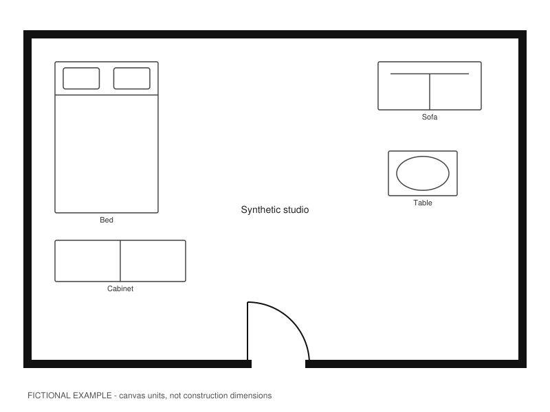

# Visualize Floorplans

English | [中文](./README.zh.md)

A concept-design workflow for homeowners and interior-design teams who need to
confirm a floor plan before exploring renovation images. Keep layout decisions,
references and accepted versions together instead of repeating corrections.

## Preview



Actual deterministic drawing output from a fictional studio, not a client plan
or a photorealistic reconstruction. [Editable source](assets/synthetic-layout-v1.svg).

## What It Does

Turn a supplied plan into a reviewed reference plan, a confirmed furniture
layout and a scoped set of renovation concept images. This beta assists design
discussion; it does not produce measured CAD, construction drawings or a
guaranteed accurate 3D reconstruction. Perspective images can drift and must
not become architectural authority. Continuous video is experimental.

## Core Capabilities

| Capability | What it helps you do |
| --- | --- |
| Plan and opening review | Separate walls, doors, windows and uncertain marks before styling. |
| Furniture confirmation | Preserve agreed furniture placement and room access. |
| Style exploration | Compare design directions or use your chosen palette directly. |
| Pre-generation checks | Fix reference conflicts and camera-relative relationships before generating. |
| Versioned handoff | Separate accepted images, rejected attempts and unresolved details. |

## Platform Compatibility

Designed for agent workflows in Codex, Claude Code and OpenClaw, with local
Python tools targeting macOS and Windows. Host image-tool availability is a
separate requirement; local tests do not establish end-to-end compatibility.

## Install

Send this to your Agent:

```text
Install this Skill for me:
https://github.com/chemny/visualize-floorplans
```

The Agent should select the appropriate installation method, check dependencies
and verify that the Skill loads.

## Quick Start

Attach a legible floor plan and send:

```text
Use visualize-floorplans to review this plan. First show the rooms, doors,
windows and uncertain details for confirmation. Do not generate renovation
images until the structure and furniture layout are confirmed.
```

The first useful result is a reviewable reference plan and a short list of
uncertainties, not an unverified photorealistic picture.

## Usage Examples

- “Keep this approved layout. Compare four styles in one preview board.”
- “Only revise the marked doorway; preserve the other furniture and openings.”
- “Stop generating images. Package the accepted plans and list unresolved items.”

## How It Works

Source review → plan/access confirmation → furniture confirmation → style
selection → batch preflight → image generation and inspection → accepted handoff.

Image inspection cannot be replaced by a passing script or a file hash. After
repeated structural errors, stop blind retries. Do not present discarded views
as verified design. Video route confirmation happens only when video is requested.

## Repository Structure

```text
SKILL.md              Agent workflow
agents/               Optional host metadata
references/           Interpretation and review rules
assets/               Templates and existing reference examples
scripts/              Local planning, drawing, validation and tests
requirements.txt      Python dependencies
.github/workflows/    macOS/Windows test matrix
```

## Requirements

Local drawing and tests require Python 3.11+, Pillow and PyMuPDF. A CJK font is
needed for Chinese labels. Image generation requires a host tool that accepts
reference images; the skill does not include a provider account or credentials.
Blender is not required. See [runtime guidance](references/platform-runtime.md).

## License

Repository code and instructions use the [MIT License](LICENSE). Dependencies
retain their own licenses; MIT does not relicense PyMuPDF or other dependencies.
Public examples are fictional. Never upload a private client plan automatically.
