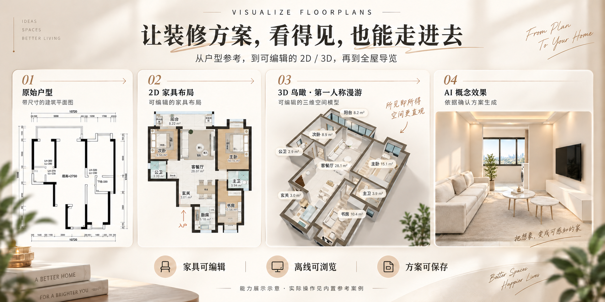

# 户型装修可视化

[English](./README.md) | 中文

面向房主的装修方案工作流：先联合核对户型图和家具参考，再在同一套可编辑
二维、三维方案上确定布局、配色、室内效果和镜头，让每份结果都有明确的依据。

## 预览



根据案例参考素材生成的能力展示示意。下方完整案例提供真实工作台、图纸和导览；AI 概念效果与可编辑三维场景是不同的输出。

**Beta 版本：0.2.0-beta.5。** 已移除自动降分辨率机制，静止、移动和高负载时均按屏幕原生像素比渲染。 修复低位吊柜的漫游碰撞，合并家具内部重复绘制，并在静止时停止重复渲染；新增局部阴影对比能力，默认关闭，待案例视觉确认后采用。合成场景的技术验证与真实户型的视觉确认分开记录。旧导览、图纸和网格暂未重新导出。Windows 图形运行、实体手机和生成式最终视频仍未实测。详见[本轮验证](references/beta5-workbench-validation.md)。

独立 HTML 导出后继续编辑，刷新可恢复最新保存，每份导出文件的数据相互隔离。连接带作为独立地面补面，在 2D/3D 中跟随相邻房间材质，面积单列；本案例保留一盏固定餐桌阴影试用。详见[工作台可靠性规则](references/workbench-reliability-rules.md)。现有中英文封面继续作为能力示意，不代表每项最新调整的截图。

## 完整参考案例


[打开「居间 · 香槟珍珠」案例](assets/reference-cases/jujian-champagne-pearl/index.html)：原始参考、13张效果图、可编辑2D/3D工作台、方案图纸和56秒导览，约54MB。

可以对智能体说：“打开这个 Skill 的内置参考案例，让我看看工作台和导览。”安装后从本地入口浏览；GitHub文件页不会直接执行HTML。当前工作台与保留的效果图、导览有灯光和材质差异，详见[案例说明](assets/reference-cases/jujian-champagne-pearl/README.md)。案例不含中间版本或核验记录。

## 主要能力

| 能力 | 它能帮你做什么 |
| --- | --- |
| 联合核对参考 | 用尺寸户型图确定结构，用家具参考确定摆放，先解决重要冲突。 |
| 离线设计工作台 | 户型图、家具布局、硬装图与同步三维视图在一个页面切换。 |
| 布置与构件编辑 | 调整家具尺寸与位置、墙体和洞口、门样式，支持测量、撤销和保存。 |
| 全屋配色 | 六款工作台模板联动家具、地板与瓷砖的二维、三维颜色和材质。 |
| 同源模型导出 | 导出实际网格、尺寸、材质、灯光状态与方案哈希。 |
| 房主方案导览 | 用明确路径和展示重点生成连续镜头预演，可选视频编码与三维软件分支。 |
| 本地交付 | 保留已确认素材，用相对链接汇总，生成带逐文件校验信息的压缩包。 |

既有概念图规划工具保留十二种设计方向，当前工作台提供六款配色模板。
确定性漫游用于查看设计和镜头；生成式最终视频另行制作与验收。
本工具不出具实测施工图、结构安全结论或全局最短路径证明，也不包含装修价格。

## 安装

把下面这句话发给当前智能体：

```text
请帮我安装这个 Skill：https://github.com/chemny/visualize-floorplans
读取技能入口，检查已有环境，并说明缺少的可选能力。
```

安装与环境检测由智能体处理。包内含本次授权收录的本地参考案例，不含账号与凭证；可选生成服务另行授权。

## 第一次使用

上传尺寸户型图和家具参考后，可以这样说：

```text
使用户型装修可视化技能。先联合核对这两张图，把影响结构和布局的冲突
列出来确认，然后建立可编辑的二维、三维装修工作台。
后面的室内效果以确认方案为依据，暂不制作视频。
```

智能体在核对后填写案例模板。已有结构化案例可用：

```text
python scripts/production/h5.py doctor
python scripts/production/h5.py build --case CASE_JSON --out NEW_WORKBENCH_HTML
```

命令中的占位符须换成真实绝对路径。构建使用包内引擎，不依赖在线资源或
软件包安装。空白模板没有默认房屋；未提供房间、墙体等实际数据时会拒绝构建。

## 工作原理

核对参考 → 确认工作台结构、布局与风格 → 导出同源模型 → 室内效果 →
按需制作连续镜头预演 → 可选生成式最终视频 → 确认后交付。

修改几何会使相关确认失效。成功导出、哈希通过或生成一张图，都不等于房主
已经认可。案例尺寸、坐标和确认记录留在案例目录。没有结构化工作台输入时，
仍可使用既有概念图规划和矢量图绘制工具。

详见[工作台工具与案例格式](references/h5-tools-and-case-schema.md)、
[制作流程](references/h5-production-workflow.md)和
[验收交付规则](references/h5-acceptance-and-handoff.md)。

## 质量检查

原图记录可读尺寸、横纵像素校准、推定内容和重要疑点。AI 图绑定准确的
H5 底图、相机和方案版本，再逐图核对结构、摆放、比例、材质与光色。
镜头检查主体在一段时间内能否持续看清，而非仅检查到达帧或路径通畅。
功能、几何、视觉与房主确认分开记录；缺失或失败的项阻止正式交付。
预览可以保留失败证据，不能借此宣称正式验收通过。

详见[质量门禁与记录格式](references/h5-quality-gates.md)。这些检查不等于自动
识图、自动判断写实图是否正确，或证明真实施工与真人通行完全可行。

## 环境与兼容性

- 构建工作台、整理模型和打包：使用已有的 Python 3.11 或更新版本。
- 浏览器导出与录制：需要已有的运行时、浏览器自动化模块和浏览器可执行文件，
  路径通过命令参数或文档中的环境变量指定。
- 视频编码：需要已有的视频编码和探测工具；三维软件是可选分支。
- 既有矢量图转图片工具：需要相应图像库与中文字体。
- 概念图和生成式视频：需要可用且已授权的宿主工具或服务，本包不含账号与凭证。

面向多种智能体宿主使用，但新抽出的工作台流程尚未完成新的跨平台端到端验证。
[运行环境说明](references/platform-runtime.md)会区分依赖可用和功能已验证。

## 文件结构

```text
SKILL.md                 技能入口与本地版本
agents/                  智能体入口配置
references/              识图、确认、工作台和交付规则
assets/reference-cases/  Curated local reference case / 精选本地参考案例
assets/h5/               通用界面、编译引擎、源码与空白案例模板
assets/h5/runtime/       同源模型播放器与三维库许可
scripts/production/      统一执行工具、路径规划与可选三维导入
scripts/                 既有概念规划、矢量绘制与检查工具
CHANGELOG.md             本地实现更新记录
THIRD_PARTY_NOTICES.md    依赖和参考代码归属说明
```

## 许可与分发

原创代码和说明使用[许可文件](LICENSE)中标明的许可。工作台继承部分使用上游
MIT 许可，完整版权和许可文本保存在
[FLOORPLAN-REFERENCE-LICENSE.txt](assets/h5/FLOORPLAN-REFERENCE-LICENSE.txt)。
Three.js 等依赖保留各自许可，详见[第三方说明](THIRD_PARTY_NOTICES.md)。

## 使用示例

```text
根据这张尺寸户型图建立可编辑二维、三维装修方案。
先展示结构疑点，再进行家具布置和室内效果制作。
```

```text
从确认方案制作房主连续导览，持续展示各房间主要功能，核对主体和通行路径。
```

## 平台兼容性

在 macOS/Codex 本地运行过。面向 Codex、Claude Code、OpenClaw 设计；
Windows 路径与调用方式接受静态审查，尚未在 Windows 机器实跑。
宿主生图能力单独检查；Seedance 与换户型端到端测试不属于本版已验证范围。
