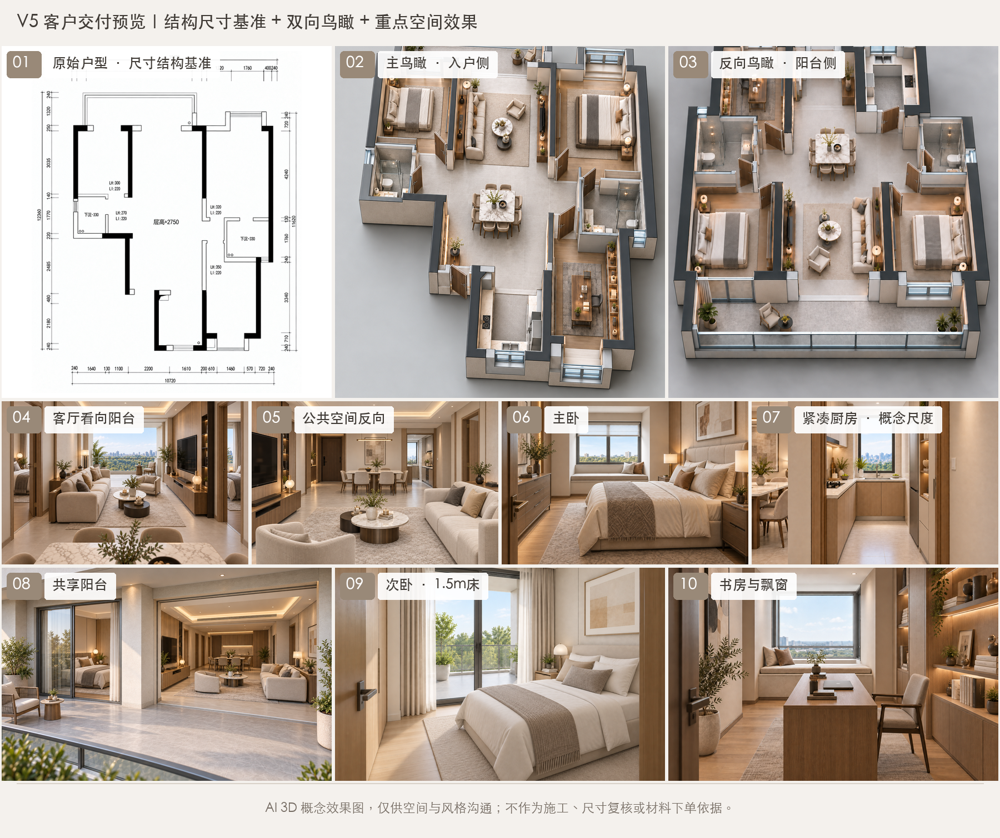

# 户型可视化

[English](./README.md) | 中文

面向业主与室内设计团队的装修概念方案工作流：先确认户型，再探索效果。
把布局决定、参考图和采用版本放在同一条流程中，减少重复纠正。

## 示例预览



前期装修概念探索示例，已获业主授权公开，非最终确认方案。这张十图合集包含
户型参考、双向鸟瞰与各空间渲染图。部分视图存在布局不一致，仅展示风格探索，
不代表已通过结构核验，也不作为施工依据。

## 它能做什么

从用户提供的户型图出发，辅助整理户型参考图、确认家具布局，并生成约定范围
的装修概念图。当前为测试版，不提供实测 CAD、施工图或保证准确的三维重建。
人视效果图可能出现结构偏差，不能反过来作为建筑依据。连续视频仍属实验能力。

## 核心能力

| 能力 | 它能帮你做什么 |
| --- | --- |
| 户型与门窗核对 | 先区分墙、门、窗及不确定线条，再讨论装修。 |
| 家具布局确认 | 保留已确定的家具位置和房间通道。 |
| 风格探索 | 对比设计方向，或直接使用指定配色。 |
| 生图前核验 | 提前消除参考版本冲突，推导不同视角的空间关系。 |
| 版本化交付 | 分开记录采用图、失败尝试和未解决事项。 |

## 平台兼容

面向 Codex、Claude Code 和 OpenClaw 的智能体工作流设计，本地 Python 工具
以 macOS 和 Windows 为适配目标。生图工具是否可用需单独检查，本地测试通过
不代表各客户端的端到端流程均已验证。

## 安装

向智能体发送：

```text
帮我安装这个 Skill：
https://github.com/chemny/visualize-floorplans
```

智能体应选择当前客户端适用的安装方式，检查依赖并验证加载。

## 快速开始

上传清晰的户型图，然后发送：

```text
使用 visualize-floorplans 检查这张户型图，先展示房间、门窗及不确定位置让我
确认。户型和家具布局确认之前，不生成装修效果图。
```

第一步应得到可核对的户型参考图和简短疑点清单，而不是未经核验的逼真图片。

## 使用示例

- “保持已确认的布局，把四种风格放在一张预览图里。”
- “只调整标记的门洞，其他家具和开口保持不变。”
- “停止继续生图，整理已采用的图纸和未解决事项。”

## 工作方式

原图检查 → 户型与门窗确认 → 家具确认 → 风格选择 → 生图前核验 → 生成与检查
→ 采用版交付。

脚本通过或文件校验值一致，不能替代实际图像检查。结构错误反复出现时，应停止
盲目重试，不把被弃用的图当成已核验方案。只有需要视频时才确认游览路线。

## 文件结构

```text
SKILL.md              智能体流程入口
agents/               可选客户端元数据
references/           识图与核验规则
assets/               模板和已有参考示例
scripts/              本地规划、绘图、校验与测试
requirements.txt      Python 依赖声明
.github/workflows/    macOS 与 Windows 测试配置
```

## 运行要求

本地绘图与测试需要 Python 3.11 及以上、Pillow、PyMuPDF；中文标注需要支持中文
的字体。生图需要宿主提供支持参考图片的工具，本仓库不提供服务账号或密钥。
Blender 不是必需依赖。详见[运行说明](references/platform-runtime.md)。

## 许可证

仓库代码和说明使用 [MIT 许可证](LICENSE)，依赖保留各自许可证，MIT 不改变
PyMuPDF 等依赖的许可要求。展示合集包含已获明确授权公开的真实户型，另附的
合成布局示例为虚构资料。未经许可不得上传客户私人户型；公开不代表图中结构
已通过核验。
